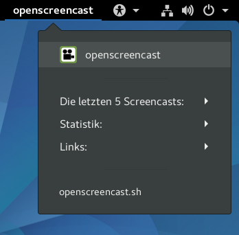

openscreencast.sh (Skript) für die Gnome Shell Extension [Argos](https://github.com/p-e-w/argos)

## Skript

### openscreencast.sh

Gnome Shell Extension Argos muss vorher installiert und aktiviert werden (Anleitung: https://github.com/p-e-w/argos).
Danach wird die Datei openscreencast.sh ins Verzeichnis ~/.config/argos/ kopiert.

Beispiel:

```
git clone https://github.com/openscreencast/gnome_shell_extension_argos_openscreencast.git
cd gnome_shell_extension_argos_openscreencast
cp openscreencast.sh ~/.config/argos/
```

    
***Screenshot***

## Lizenz

[CC Zero 1.0](https://github.com/openscreencast/gnome_shell_extension_argos_openscreencast/blob/master/LICENSE)
